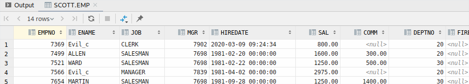
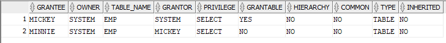

### 1. Einleitung
Dieses Dokument ist im Rahmen des Moduls dbarc entstanden und geht auf die Fragenstellungen der Übung 3 ein.
Konkret befasst sich diese mit der Zugriffssteuerung und den Views.
Für eine bessere Übersicht sind SQL-Befehle in Konsolenschrift und die Syntax zusätzlich in Grossbuchstaben beschrieben, ggf. werden diese mit weiterführenden Befehlen ergänzt.


### 2. Vorbereitung (als user system)

```sql
-- Create two other users
CREATE USER charlie IDENTIFIED BY charliesSuperSecurePassword;
CREATE USER snoopy IDENTIFIED BY snoopysSuperSecurePassword;

-- Grant essential privileges
GRANT CREATE SESSION TO charlie;
GRANT CREATE SESSION TO snoopy;

-- Allow user scott to create rules
GRANT CREATE ROLE TO scott;

-- Allow user scott to create views
GRANT CREATE VIEW TO scott;
```

### 3. Views

#### 3.1 DDL-Änderungen an den Basistabellen (als user scott)

Zunächst wird eine View erstellt:

```sql
CREATE OR REPLACE VIEW emp_seniority_view
AS SELECT ename, hiredate
FROM emp;
```

Zusätzliche Spalte in die Tabelle `EMP` einfügen:

```sql
ALTER TABLE emp ADD FIRED date;
```

Diese Operation konnte ohne zusätzliche Privilages mit dem User Scott ausgeführt werden. Dies liegt daran das er der Owner der Tabelle `emp` ist: Wir verifizieren dies mit:

```sql
-- List tables owned by user scott
SELECT * FROM  CAT;
```


#### 3.2.1 Updateable Views

Grundsätzlich sind `UPDATE`, `INSERT` und `DELETE` Befehle auf Views problemlos möglich. Allerdings mit folgenden Einschränkungen:

| Einschränkung                                                                   | `DELETE` |  `UDPATE` | `INSERT` |
|---------------------------------------------------------------------------------|----------|----------|----------|
| Gruppenfunktionen                                                               | x        | x        | x        |
| `GROUP BY` Klausel                                                              | x        | x        | x        |
| das Schlüsselwort `DISTINCT`                                                    | x        | x        | x        |
| die Pseudospalte `ROWNUM`                                                       | x        | x        | x        |
| durch Ausdrücke definierte Spalten                                              |          | x        | x        |
| `NOT NULL` Spalten der Basistabelle, die nicht durch die View ausgewählt werden |          |          | x        |

Funktionierendes Beispiel an einem `UPDATE`:

```sql
UPDATE EMP_SENIORITY_VIEW SET HIREDATE = CURRENT_TIMESTAMP WHERE ENAME = 'SMITH';
```


Nun erstellen wir eine neue View welche eine Funktion enthält:

```sql
-- Create view
CREATE OR REPLACE VIEW emp_function_demo_view
    (ENAME,SAL)
AS SELECT concat(ENAME, JOB), SAL
   FROM emp;

-- show result
SELECT * FROM emp_function_demo_view;
```


Nun versuchen wir ein Wert in dert Spalte `ENAME` zu ändern:

```sql
UPDATE emp_function_demo_view SET ENAME = 'Test1' WHERE ENAME = 'SMITHCLERK';
```

**Fehler**: `virtual column not allowed here`

#### 3.2.2 Join Views

Als erstes erstellen wir eine entsprechende View:

```sql
CREATE OR REPLACE VIEW emp_dept_view
            (empno, ename, dname)
AS SELECT empno, ename, dname
   FROM EMP JOIN DEPT USING (deptno);
```

Grundsätzlich gilt, wir können nur Daten der Tabelle änderen welche `key-preserved` ist, dass heisst in dieser Tabelle wo der Primarykey erhalten bleibt. In unserem Fall ist das `EMP`.
Aus diesem Grund funktioniert der folgende Query auch problemlos:

```sql
UPDATE emp_dept_view SET ENAME = 'TESTER' WHERE DNAME = 'RESEARCH';
```


Wollen wir hingeben auf `DEPT` etwas ändern:

```sql
UPDATE emp_dept_view SET DNAME = 'TESTER' WHERE EMPNO = '7369';
```

**Fehler:** `cannot modify a column which maps to a non key-preserved table`  
(Diese Einschränkung gilt auch wenn eine 1-1 Beziehung Vorhanden ist)

#### 3.3 WITH CHECK OPTION

Ohne die `CHECK OPTION` ist es möglich, dass ein User Daten aus der View "verschwinden" lassen kann - er kann Änderungen durchführen welche in der View nicht sichtbar sind. Um dies zu demonstrieren erstellen wir zuerst zwei Views ohne `CHECK OPTION`:

```sql
-- create views
CREATE OR REPLACE VIEW sal_gt_1000_view
AS SELECT * FROM EMP WHERE SAL > 1000;

CREATE OR REPLACE VIEW sal_gt_1000_and_dept_eq_30_view
AS SELECT * FROM sal_gt_1000_view WHERE DEPTNO = 30;

-- Show result
SELECT * FROM sal_gt_1000_and_dept_eq_30_view;
```

Wir lassen nun demonstrativ einen Mitarbeiter "verschwinden" indem bei _WARD_ das Department geändert wird:
```sql
UPDATE sal_gt_1000_and_dept_eq_30_view SET DEPTNO = 20 WHERE EMPNO = 7521;
SELECT * FROM sal_gt_1000_and_dept_eq_30_view;
```


Setzen wir nun auf der `sal_gt_1000_and_dept_eq_30_view` die `CHECK OPTION`
```sql
CREATE OR REPLACE VIEW sal_gt_1000_and_dept_eq_30_view
AS SELECT * FROM sal_gt_1000_view WHERE DEPTNO = 30 WITH CHECK OPTION;
-- Try again
UPDATE sal_gt_1000_and_dept_eq_30_view SET DEPTNO = 20 WHERE EMPNO = 7654;
```
**Fehler:** `view WITH CHECK OPTION where-clause violation`

Untersuchen wir auch noch den Fall wenn die `CHECK OPTION` nur auf `sal_gt_1000_view` gesetzt ist:
```sql
-- remove check option from combined view
CREATE OR REPLACE VIEW sal_gt_1000_and_dept_eq_30_view
AS SELECT * FROM sal_gt_1000_view WHERE DEPTNO = 30;

CREATE OR REPLACE VIEW sal_gt_1000_view
AS SELECT * FROM EMP WHERE SAL > 1000 WITH CHECK OPTION;

-- Try again
UPDATE sal_gt_1000_and_dept_eq_30_view SET DEPTNO = 20 WHERE EMPNO = 7654;
```


Der vorherige Update funktioniert nun ohne Probleme. Die Schlussfolgerung daraus ist, `CHECK OPTION` funktioniert nur innerhalb
ihrer view!

### 4 Zugriffssteuerung mit User und Rollen
#### 4.1 View erstellen
```sql
CREATE OR REPLACE VIEW emp_summary_view
AS SELECT ename, job, dname, loc
FROM  EMP JOIN DEPT D on EMP.DEPTNO = D.DEPTNO;

-- show result
SELECT * FROM emp_summary_view;
```

#### 4.2 Rollen definieren

```sql
CREATE ROLE emp_user_role;
CREATE ROLE emp_manager_role;
```
#### 4.3 Den Rollen Rechte zuweisen
```sql
GRANT SELECT ON emp_summary_view TO emp_user_role;
GRANT SELECT,UPDATE,INSERT,ALTER,DELETE ON EMP TO emp_manager_role;
GRANT CREATE VIEW TO emp_manager_role;
```
#### 4.4 Den User Rollen zuweisen
```sql
GRANT emp_user_role TO charlie;
GRANT emp_manager_role TO snoopy;
```
#### 4.5 Überprüfen Sie die beiden Rollen
##### 4.5.1 User `charlie`:
```sql
SELECT * FROM SCOTT.emp_summary_view;
```

```sql
UPDATE SCOTT.EMP_SUMMARY_VIEW SET ENAME = 'Evil_c' WHERE ENAME = 'TESTER';
```
**Fehler:** `insufficient privileges`

##### 4.5.2 User `snoopy`:
Versuchen wir das gleiche Update nun mit dem user snoopy:
```sql
UPDATE SCOTT.EMP SET ENAME = 'Evil_c' WHERE ENAME = 'TESTER';
SELECT * FROM SCOTT.EMP;
```



### 5 Zugriffsrechte: Objekt- und Systemrechte

#### 5.1 Objektrechte
##### 5.1.1 Was sind Objektrechte?
Sie berechtigen dazu, Operationen auf existierenden Objekten auszuführen.
Die Rechte können einem Datenbankbenutzer oder einer Rolle zugeteilt werden können, um so gewisse Operationen auf der Objektebene auszuführen. 
Diese Operationen können `SELECT` , `INSERT` , `UPDATE` , `DELETE` , `ALTER` , `INDEX` auf Tabellen und Views oder `EXECUTE` auf Prozeduren und Fuktionen sein.
Ebenso gibt es die Möglichkeit, einzelne Operationen auszunehmen.

##### 5.1.2 Das Experiment
In diesem Experiment wollen wir untersuchen, ob weitergegebene Objektrechte kaskadierend entfernt werden.
Dazu legen wir uns als `system` zwei neue Benutzer `mickey` und `minnie` an:
```sql
CREATE USER mickey IDENTIFIED BY mickeyInDisneyLand;
-- User MICKEY erstellt.

GRANT CREATE SESSION TO mickey;
-- Grant erfolgreich.


CREATE USER minnie IDENTIFIED BY minnieInDisneyLand;
-- User MINNIE erstellt.

GRANT CREATE SESSION TO minnie;
-- Grant erfolgreich.
```


Nun geben wir `mickey` die Berechtigung, `SELECT`-Statements auf der Tabelle `emp` auszuführen und diese auch weiterzugeben:
```sql
GRANT SELECT ON scott.emp TO mickey WITH GRANT OPTION;
-- Grant erfolgreich.
```


Als `mickey` geben wir die `SELECT`-Berechtigung an `minnie` weiter:
```sql
GRANT SELECT ON scott.emp TO minnie;
-- Grant erfolgreich.
```


Mit dem folgenden SQL-Statement lassen sich die Berechtigungseinträge für die Tabelle `emp` anzeigen:
```sql
SELECT * FROM USER_TAB_PRIVS WHERE TABLE_NAME = 'EMP';
```


Der Benutzer `system` entzieht nun `mickey` die zuvor erteilte Berechtigung mit:
```sql
REVOKE SELECT ON scott.emp FROM mickey;
-- Revoke erfolgreich.
```


##### 5.1.3 Beobachtung
Schauen wir uns jetzt nochmals die Berechtigungseinträge mit dem obigen Statement an, so stellen wir fest das keine Einträge mehr vorhanden sind.


Die mit `GRANT OPTION` verteilten Berechtigungen werden also kaskadierend widerrufen.


#### 5.2 Systemrechte

##### 5.2.1 Was sind Systemrechte?
Sie berechtigen zu Schemaoperationen konkret geht es hier um die Operationen `CREATE` , `ALTER` , `DROP` und die bereits bekannten Objektoperationen. 
Diese Rechte können analog zu den Objektrechten pro Benutzer oder systemweit verteilt oder widerrufen werden.
Zugriffe und Veränderungen an den eigenen Tabellen werden nicht explizit aufgeführt, es ist bereits durch die Architektur gegeben.

##### 5.2.2 Das Experiment
In diesem Experiment wollen wir untersuchen, ob weitergegebene Systemrechte kaskadierend entfernt werden.
Dazu greifen wir auf die zuvor von `system` angelegten Benutzer `mickey` und `minnie` zurück.


Nun geben wir `mickey` die Berechtigung, in jedem Schema Tabellen zu erzeugen und diese auch weiterzugeben:
```sql
GRANT CREATE ANY TABLE TO mickey WITH ADMIN OPTION;
-- Grant erfolgreich.
```


Als `mickey` erstellen wir eine Tabelle und geben diese `CREATE`-Berechtigung an `minnie` weiter:
```sql
CREATE TABLE mickey_friends(
    friend_id NUMBER,
    first_name VARCHAR2(50) NOT NULL,
    last_name VARCHAR2(50) NOT NULL,
    PRIMARY KEY(friend_id)
);
-- Table MICKEY_FRIENDS erstellt.

GRANT CREATE ANY TABLE TO minnie;
-- Grant erfolgreich.
```


Als `minnie` erstellen wir ebenfalls eine Tabelle:
```sql
CREATE TABLE minnie_friends(
    friend_id NUMBER,
    first_name VARCHAR2(50) NOT NULL,
    last_name VARCHAR2(50) NOT NULL,
    PRIMARY KEY(friend_id)
);
-- Table MINNIE_FRIENDS erstellt.
```

Mit dem folgenden SQL-Statement lassen sich die Systemrechte für `mickey` und `minnie` anzeigen:
```sql
SELECT * FROM SYS.DBA_SYS_PRIVS WHERE GRANTEE = 'MICKEY' OR GRANTEE = 'MINNIE';
```


Der Benutzer `system` entzieht nun `mickey` die zuvor erteilte Berechtigung mit:
```sql
REVOKE CREATE ANY TABLE FROM mickey;
-- Revoke erfolgreich.
```


##### 5.2.3 Beobachtung
Schauen wir uns jetzt nochmals die Systemrechte mit dem obigen Statement an:

Anderst als bei den Objektrechten ist hier kein kaskadierendes Verhalten erkennbar, wenn man Systemrechte für `mickey` widerruft, bleiben jene von `minnie` bestehen.
Es hat keinen Einfluss, ob die Berechtigung mittels `ADMIN OPTION` erteilt wurde.

Mit dem folgenden SQL-Statement überprüfen wir zusätzlich, ob die jeweils erstellten Tabellen noch existieren:
```sql
SELECT OWNER, TABLE_NAME FROM ALL_TABLES WHERE OWNER = 'MICKEY' OR OWNER = 'MINNIE';
```


Die Tabellen existieren nach wie vor und wurden nicht mit den Systemrechten zusammen entfernt.

Die mit `ADMIN OPTION` verteilten Berechtigungen werden also **nicht** kaskadierend widerrufen:


#### 5.3 Rechte auf Views

##### 5.3.1 Szenario
Der Benutzer `scott` ermöglicht dem Benutzer `snoopy` Lesezugriff auf die `EMP`-Tabelle allerdings ohne die `WITH GRANT OPTION`,
damit kann `snoopy` die Berechtigung nicht weitergeben.

##### 5.3.2 Das Experiment
Der Benutzer `charlie` möchte nun über `snoopy` auf die `EMP`-Tabelle zugreifen. Da `snoopy` die Berechtigung hat, neue Views zu erstellen,
verfolgen wir diesen Ansatz weiter.


Wir erstellen mit dem Benutzer `snoopy` eine neue View für die `EMP`-Tabelle. Damit das Funktioniert
müssen wir allerdings noch etwas Vorarbeit leisten Zitat Oracle-Doc:

`The owner of the schema containing the view must have the privileges necessary to either select, insert, update, or delete rows from all the tables or views on which the view is based. The owner must be granted these privileges directly, rather than through a role`

_--https://docs.oracle.com/cd/B28359_01/server.111/b28286/statements_8004.htm_
```sql
GRANT SELECT on scott.emp TO snoopy;
```

```sql
CREATE OR REPLACE VIEW EMP_FOR_CHARLIE_VIEW AS SELECT EMPNO, ENAME, JOB, HIREDATE FROM SCOTT.EMP;
```

Anschliessend geben wir diese View mit den selben Berechtigungen an `charlie` weiter:
```sql
GRANT SELECT,INSERT,DELETE,UPDATE ON snoopy.EMP_FOR_CHARLIE_VIEW TO charlie;
-- GRANT erfolgreich.
```

##### 5.3.3 Beobachtung
Damit lässt dich die `GRANT OPTION` umgehen und die Berechtigungen weitergeben, allerdings müssen Referenzen auf Views separat erlaubt werden.