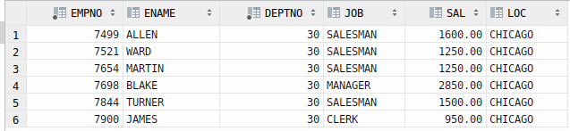

### 2. Vorbereitung
Als user `system`

```sql
-- Create two other users
CREATE USER charlie IDENTIFIED BY charliesSuperSecurePassword;
CREATE USER snoopy IDENTIFIED BY snoopysSuperSecurePassword;
-- Grant essential privileges
GRANT CREATE SESSION TO charlie;
GRANT CREATE SESSION TO snoopy;

-- Allow user scott to create rules
GRANT CREATE ROLE TO scott;

-- Allow user scott to create views
GRANT CREATE VIEW TO scott;
```

### 3. Views

#### 3.1 DDL-Änderungen an den Basistabellen (mit user scott)

Zunächst wird eine View erstellt:

```sql
CREATE OR REPLACE VIEW emp_seniority_view
AS SELECT ename, hiredate
FROM emp;
```

Zusätzliche Spalte in die Tabelle `EMP` einfügen:

```sql
ALTER TABLE emp ADD FIRED date;
```

Diese Operation konnte ohne zusätzliche Privilages mit dem User Scott ausgeführt werden. Dies liegt daran das er der Owner der Tabelle `emp` ist: Wir verifizieren dies mit:

```sql
SELECT * FROM  CAT;
```


#### 3.2.1 Updateable Views

Grundsätzlich sind `UPDATE`, `INSERT` und `DELETE` Befehle problemlos möglich. Allerdings mit folgenden Einschränkungen:

| Einschränkung                                                                   | `DELETE` | `UDPATE` | `INSERT` |
|---------------------------------------------------------------------------------|----------|----------|----------|
| Gruppenfunktione                                                                | x        | x        | x        |
| `GROUP BY` Klausel                                                              | x        | x        | x        |
| das Schlüsselwort `DISTINCT`                                                    | x        | x        | x        |
| die Pseudospalte `ROWNUM`                                                       | x        | x        | x        |
| durch Ausdrücke definierte Spalten                                              |          | x        | x        |
| `NOT NULL` Spalten der Basistabelle, die nicht durch die View ausgewählt werden |          |          | x        |

Beispiel an einem `UPDATE`:

```sql
UPDATE EMP_SENIORITY_VIEW SET HIREDATE = CURRENT_TIMESTAMP WHERE ENAME = 'SMITH';
```


Nun erstellen wir eine neue View welche eine Funktion enthält:

```sql
CREATE OR REPLACE VIEW emp_function_demo_view
    (ENAME,SAL)
AS SELECT concat(ENAME, JOB), SAL
   FROM emp;
```

```sql
SELECT * FROM emp_function_demo_view;
```


```sql
UPDATE emp_function_demo_view SET ENAME = 'Test1' WHERE ENAME = 'SMITHCLERK';
```

**Fehler**: `virtual column not allowed here`

#### 3.2.2 Join Views

Als erstes erstellen wir eine entsprechende View:

```sql
CREATE OR REPLACE VIEW emp_dept_view
            (empno, ename, dname)
AS SELECT empno, ename, dname
   FROM EMP JOIN DEPT USING (deptno);
```

Grundsätzlich gilt wir können nur Daten der Tabelle änderen welche `key-preserved` ist, dass heisst in dieser Tabelle wo der Primarykey erhalten bleibt. In unserem Fall ist das `EMP`

```sql
UPDATE emp_dept_view SET ENAME = 'TESTER' WHERE DNAME = 'RESEARCH';
```


Wollen wir hingeben auf `DEPT` etwas ändern:

```sql
UPDATE emp_dept_view SET DNAME = 'TESTER' WHERE EMPNO = '7369';
```

**Fehler:** `cannot modify a column which maps to a non key-preserved table` Diese Einschränkung gilt auch wenn eine 1-1 Beziehung Vorhanden ist.

#### 3.3 WITH CHECK OPTION

Ohne die `CHECK OPTION` ist es möglich das ein User Daten aus der View "verschwinden" lassen kann - er kann Änderungen durchführen welche in der View nicht sichtbar sind. Um dies zu demonstrieren erstellen wir zuerst eine View ohne `CHECK OPTION`:

```sql
CREATE OR REPLACE VIEW emp_sales_view
AS SELECT empno,ename, deptno,job,sal
    FROM EMP WHERE DEPTNO = 30;

CREATE OR REPLACE VIEW emp_sales_loc
AS SELECT empno, ename, deptno, job, sal,loc
    FROM emp_sales_view JOIN DEPT USING(deptno);

SELECT * FROM emp_sales_loc;
```


Wir lassen nun demonstrativ einen Mitarbeiter "verschwinden" indem bei _ALLEN_ das Department geändert wird:

```sql
UPDATE EMP_SALES_VIEW SET DEPTNO = 20 WHERE EMPNO = 7499;
SELECT * FROM emp_sales_loc;
```

**TODO:** Noch nicht fertig, fragen was er hier genau will

### 4 Zugriffssteuerung mit User und Rollen
#### 4.1 View erstellen
```sql
CREATE OR REPLACE VIEW emp_summary_view
AS SELECT ename, job, dname, loc
FROM  EMP JOIN DEPT D on EMP.DEPTNO = D.DEPTNO;

SELECT * FROM emp_summary_view;
```

#### 4.2 Rollen definieren
```sql
CREATE ROLE emp_summary_ro_role;
CREATE ROLE emp_summary_rw_role;
```
#### 4.3 Den Rollen Rechte zuweisen
```sql
GRANT SELECT ON emp_summary_view TO emp_user_role;
GRANT SELECT,UPDATE, INSERT,ALTER,DELETE ON EMP TO emp_manager_role;
```
#### 4.4 Den User Rollen zuweisen
```sql
GRANT emp_user_role TO charlie;
GRANT emp_manager_role TO snoopy;
```
#### 4.5 Überprüfen Sie die beiden Rollen
##### 4.5.1 User `charlie`:
```sql
SELECT * FROM SCOTT.emp_summary_view;
```

```sql
UPDATE SCOTT.EMP_SUMMARY_VIEW SET ENAME = 'Evil_c' WHERE ENAME = 'TESTER';
```
**Fehler:** `insufficient privileges`

##### 4.5.2 User `snoopy`:


### 5 Zugriffsrechte: Objekt- und Systemrechte

Wichtig hier wünscht er so ein graph 

#### 5.1 Objektrechte

#### 5.2 Systemrechte

#### 5.3 Rechte auf Views
