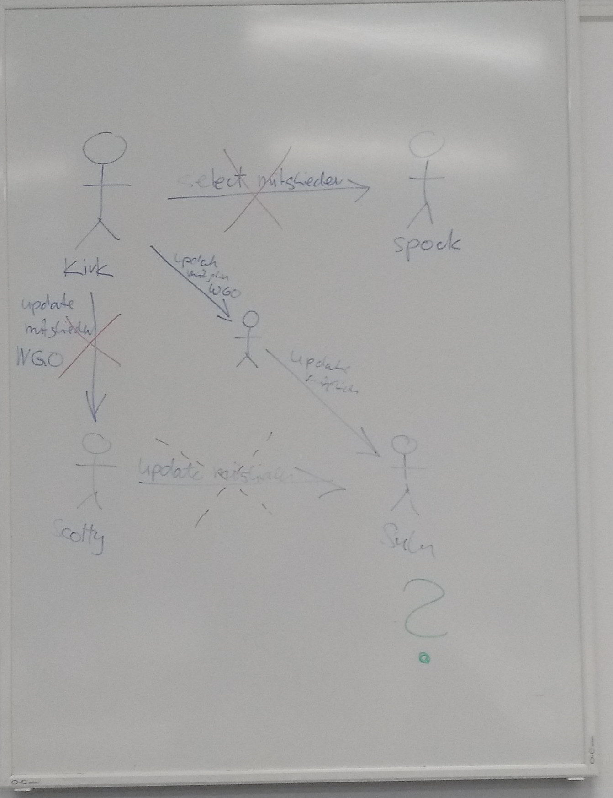

### 2. Vorbereitung


Als user `system`

```
-- Create two other users
CREATE USER charlie IDENTIFIED BY charliesSuperSecurePassword;
CREATE USER snoopy IDENTIFIED BY snoopysSuperSecurePassword;

-- Allow user scott to create rules
GRANT CREATE ROLE TO scott;

-- Allow user scott to create views
GRANT CREATE VIEW TO scott;
```

### 3. Views

#### 3.1 DDL-Änderungen an den Basistabellen (mit user scott)

Zunächst wird eine View erstellt:

```
CREATE OR REPLACE VIEW emp_seniority_view
AS SELECT ename, hiredate
FROM emp;
```

Zusätzliche Spalte in die Tabelle `EMP` einfügen:

```
ALTER TABLE emp ADD FIRED date;
```

Diese Operation konnte ohne zusätzliche Privilages mit dem User Scott ausgeführt werden. Dies liegt daran das er der Owner der Tabelle `emp` ist: Wir verifizieren dies mit:

```
SELECT * FROM  CAT;
```


#### 3.2.1 Updateable Views

Grundsätzlich sind `UPDATE`, `INSERT` und `DELETE` Befehle problemlos möglich. Allerdings mit folgenden Einschränkungen:

| Einschränkung | `DELETE` | `UDPATE` | `INSERT` | |---------------------------------------------------------------------------------|----------|----------|----------| | Gruppenfunktione | x | x | x | | `GROUP BY` Klausel | x | x | x | | das Schlüsselwort `DISTINCT` | x | x | x | | die Pseudospalte `ROWNUM` | x | x | x | | durch Ausdrücke definierte Spalten | | x | x | | `NOT NULL` Spalten der Basistabelle, die nicht durch die View ausgewählt werden | | | x |

Beispiel an einem `UPDATE`:

```
UPDATE EMP_SENIORITY_VIEW SET HIREDATE = CURRENT_TIMESTAMP WHERE ENAME = 'SMITH';
```


Nun erstellen wir eine neue View welche eine Funktion enthält:

```
CREATE OR REPLACE VIEW emp_function_demo_view
    (ENAME,SAL)
AS SELECT concat(ENAME, JOB), SAL
   FROM emp;
```

```
SELECT * FROM emp_function_demo_view;
```


```
UPDATE emp_function_demo_view SET ENAME = 'Test1' WHERE ENAME = 'SMITHCLERK';
```

**Fehler**: `virtual column not allowed here`

#### 3.2.2 Join Views

Als erstes erstellen wir eine entsprechende View:

```
CREATE OR REPLACE VIEW emp_dept_view
            (empno, ename, dname)
AS SELECT empno, ename, dname
   FROM EMP JOIN DEPT USING (deptno);
```

Grundsätzlich gilt wir können nur Daten der Tabelle änderen welche `key-preserved` ist, dass heisst in dieser Tabelle wo der Primarykey erhalten bleibt. In unserem Fall ist das `EMP`

```
UPDATE emp_dept_view SET ENAME = 'TESTER' WHERE DNAME = 'RESEARCH';
```


Wollen wir hingeben auf `DEPT` etwas ändern:

```
UPDATE emp_dept_view SET DNAME = 'TESTER' WHERE EMPNO = '7369';
```

**Fehler:** `cannot modify a column which maps to a non key-preserved table` Diese Einschränkung gilt auch wenn eine 1-1 Beziehung Vorhanden ist.

#### 3.3 WITH CHECK OPTION

Ohne die `CHECK OPTION` ist es möglich das ein User Daten aus der View "verschwinden" lassen kann - er kann Änderungen durchführen welche in der View nicht sichtbar sind. Um dies zu demonstrieren erstellen wir zuerst eine View ohne `CHECK OPTION`:

```
CREATE OR REPLACE VIEW emp_sales_view
AS SELECT empno,ename, deptno,job,sal
    FROM EMP WHERE DEPTNO = 30;

CREATE OR REPLACE VIEW emp_sales_loc
AS SELECT empno, ename, deptno, job, sal,loc
    FROM emp_sales_view JOIN DEPT USING(deptno);
```

### 4 Zugriffssteuerung mit User und Rollen

#### 4.1 View erstellen

#### 4.2 Rollen definieren

#### 4.3 Den Rollen Rechte zuweisen

#### 4.4 Den User Rollen zuweisen

#### 4.5 Überprüfen Sie die beiden Rollen

### 5 Zugriffsrechte: Objekt- und Systemrechte

Wichtig hier wünscht er so ein graph 

#### 5.1 Objektrechte

#### 5.2 Systemrechte

#### 5.3 Rechte auf Views