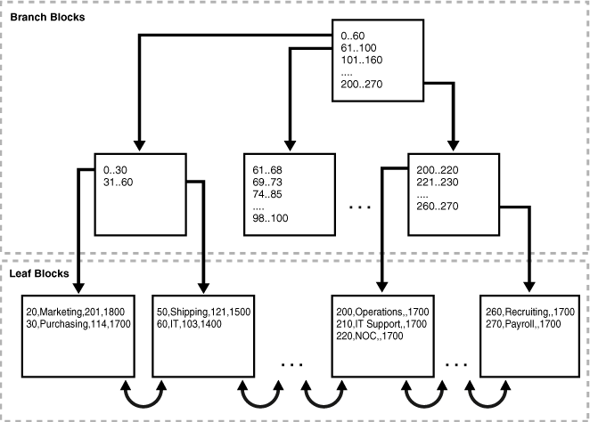

### Autoren
- Tobias Bossert
- Jilin Elavathingal

### 1 Dokumentation

### 2 Einleitung

### 3 Speicher- und Zugriffsstrukturen
dbarc01 Index-Organized Tables mit einem zusätzlichen Sekundärindex

### 4 Aufgabe
#### 4.1 Studieren Sie die entsprechenden Abschnitte im Concepts Manual Kapitel 3.
#### 4.2 Konsultieren Sie zusätzliche Quellen (z.B. Wikipedia).
#### 4.3 Gehen Sie dabei folgenden Fragen nach:
##### 4.3.1 Wie „funktionieren“ die Strukturen bzw. was sind Index Scans und welche Arten gibt es?

- Primary key indentifiziert eindeutig eine DB-Zeile, ein Primary Key Constraint muss definiert werden.
- Ein pseudocolum `ROWID` erlaubt es, Sekundärindizes zu generieren.
- Diese Struktur kann nicht in einem Tabellen-Cluster gespeichert werden.
- Kann LOB (Large Object) aber keine `LONG` Typen aufnehmen.
- Kann keine virtuellen Spalten enthalten.
Die Index-Organized-Tabellen speichern die Daten in gleichen Strukturen ab und macht so eine rowid überflüssig.
Der Sekundärindex ist ein Index auf einer Index-Organized-Tabelle und somit ein Index eines Indexes,
er ist unabhängig vom Schemaobjekt und wird separat von der Tabelle abgespeichert.

Die verschiedenen Index Scans:

**Index Scan** - Abfrage einer Zeile, anhand der indexierten Spalten. Wenn nur indexierte Spalten abgefragt werden,
werden die Daten direkt vom Index zurückgegeben, anstatt von der Tabelle.

**Full Index Scan** - Abfrage von mehreren Zeilen, anhand der indexierten Spalten. Dies ist möglich, wenn die im
`WHERE` Klausel verwendeten Spalten indexiert sind. Dieser Scan macht ein Sorting überflüssig, da die Daten
nach dem Index-Key sortiert werden. (Der Suchbereich wird massgeblich kleiner.)
```sql
SELECT department_id, last_name, salary 
FROM   employees
WHERE  salary > 5000 
ORDER BY department_id, last_name;

-- department_id, last_name and salary are a composite key in an index.

 50 Atkinson  2800 rowid
 60 Austin    4800 rowid
 70 Baer     10000 rowid
 80 Abel     11000 rowid
 80 Ande      6400 rowid
110 Austin    7200 rowid
```

**Fast Full Index Scan** - Eigentlich ein Full Index Scan, nur dass alle Daten im Index verfügbar sind, ohne auf die
Tabelle zugreifen zu müssen. Die Blöcke werden in keiner bestimmten Reihenfolge gelesen. Die Voraussetzung ist,
dass der Index alle im Query verwendeten Spalten enthält und die Zeilen keine `NULL` Werte in indexierten Spalten
haben. Also muss mindestens eine Spalte ein `NOT NULL` constraint haben oder mit einem Prädikat diese Zeilen
heraus gefiltert werden.
```sql
SELECT ename, sal 
FROM   scott.emp;

-- last_name column has a not null constraint.

Baida    2900 rowid
Zlotkey 10500 rowid
Austin   7200 rowid
Baer    10000 rowid
Atkinson 2800 rowid
Austin   4800 rowid
```

**Index Range Scan** - Das ist ein sortierter Scan von indexierten Spalten, dabei müssen mind. eine oder mehrere
Spalten in der Bedingung vorhanden sein.
Kann ein zusätzlicher Sekundärindex verwendet werden um ein Ergebnisbereich einzugrenzen?
```sql
WHERE last_name LIKE 'A%'

-- last_name is indexed and names starting with A

Abel     rowid
Ande     rowid
Atkinson rowid
Austin   rowid
Austin   rowid
Baer     rowid
```

**Index Unique Scan** - Hier wird eine rowid direkt mit einem Index-Key gemappt. Der Scan wird nach dem ersten Match
abgebrochen.
```sql
SELECT *
FROM   employees
WHERE  employee_id = 5;

-- employee_id column is the primary key and is indexed with entries

1 rowid
2 rowid
4 rowid
5 rowid
6 rowid
```

**Index Skip Scan** - Die verschiedenen Indizes werden verwendet, um verschiedene Suchpfade zu generieren. Dabei kann der Optimizer
gezielt die Reihenfolge der Indizes anpassen.
```sql
SELECT * 
FROM   sh.customers 
WHERE  cust_email = 'Abbey@company.com';

-- column cust_gender whose values are either M or F
-- composite index exists on the columns (cust_gender, cust_email)

F Wolf@company.com      rowid
F Wolsey@company.com    rowid
F Wood@company.com      rowid
F Woodman@company.com   rowid
F Yang@company.com      rowid
F Zimmerman@company.com rowid
M Abbassi@company.com   rowid
M Abbey@company.com     rowid
```
##### 4.3.2 Wo werden die Strukturen mit Vorteil eingesetzt bzw. werden die Index Scans verwendet?
Bei Suchanfragen über eine grosse Datenmenge, kann diese Struktur das Ergebnis schon erheblich verkleinern,
und damit die Performance steigern. Dies ist vor allem der Fall von die darunterliegende Tabelle primär gelesen werden muss.

(Verwendung der Index Scans siehe 4.3.1)
##### 4.3.3 Wann sind die Strukturen ungeeignet bzw. werden die Index Scans nicht eingesetzt?
Die `logical rowids` enthalten auch immer einen `physical guess` welcher auf die physikalische rowid des records zeigt. 
Dieser ist allerdings nicht dynamisch und wird bei Erstellung des Sekundär-Indexes erstellt. Werden nun Zeilen in die Tabelle eingefügt oder
gelöscht stimmt dieser Zeiger nicht mehr. Dies hat zur Folge, das der falsche Block geladen wird, wieder verworfen wird und ein
`unique index scan` über den Primary-Key gemacht wird. Der Index müsste in dem Fall aktualisiert werden.
Bei Tabellen mit vielen Zeilen inserts oder drops ist also ein Sekundärindex nur bedingt hilfreich.


##### 4.3.4 Wie werden die Strukturen physisch dargestellt?
(Darstellung unter 4.3.1)
Man kann die Darstellung mit einem Mapfile oder einem Dictionary vergleichen.

#### 4.4 Beschreiben Sie ein typisches Beispiel und realisieren Sie es in Ihrer Datenbank.
Auf der `EMP` Tabelle erstellen wir einen Sekundärindex, damit die Buchhaltung schneller nach den Lohnklassen filtern kann.
```sql
CREATE INDEX EMP_SAL_INDEX ON SCOTT.EMP(SAL);
```

#### 4.5 Zeigen Sie, mit welchen Abfragen die Strukturen bzw. die Index Scans durch den Optimizer tatsächlich verwendet werden und wann nicht.
```sql
SELECT * FROM SCOTT.EMP WHERE SAL >= 1000 AND SAL < 3000;

/**
Plan hash value: 812126833 
-----------------------------------------------------------------------------------------------------
| Id  | Operation                           | Name          | Rows  | Bytes | Cost (%CPU)| Time     |
-----------------------------------------------------------------------------------------------------
|   0 | SELECT STATEMENT                    |               |     9 |   864 |     2   (0)| 00:00:01 |
|   1 |  TABLE ACCESS BY INDEX ROWID BATCHED| EMP           |     9 |   864 |     2   (0)| 00:00:01 |
|*  2 |   INDEX RANGE SCAN                  | EMP_SAL_INDEX |     9 |       |     1   (0)| 00:00:01 |
-----------------------------------------------------------------------------------------------------
 
Predicate Information (identified by operation id):
---------------------------------------------------
 
   2 - access("SAL">=1000 AND "SAL"<3000)
 
Note
-----
   - dynamic statistics used: dynamic sampling (level=2)
**/
```
### 5 Hinweise
Ausführungspläne können Sie anzeigen und damit ermittlen, mit welchen Strukturen und
Scans Anfragen durchgeführt werden.
#### 5.1 Statistiken erheben z.B. für Tabelle emp im Schema scott mit
```sql
BEGIN
DBMS_STATS.GATHER_TABLE_STATS('scott','emp');
END;
```
#### 5.2 Ausführungsplans ermitteln für ein SELECT-Statement mit folgendem Muster
```sql
EXPLAIN PLAN FOR
SELECT *
FROM emp JOIN dept USING (deptno);
```
#### 5.3 Anzeigen des Ausführungsplans
```sql
SELECT plan_table_output
FROM TABLE(DBMS_XPLAN.DISPLAY('plan_table',null,'typical'));
```