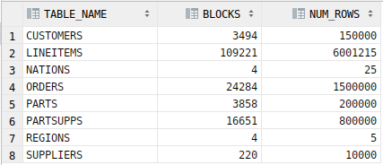

### Autoren
- Tobias Bossert
- Jilin Elavathingal

### 1. Einleitung
Dieses Dokument ist im Rahmen des Moduls dbarc entstanden und geht auf die Fragenstellungen der Übung 8 ein.
Konkret befasst sich diese mit SQL-Tuneing.
Für eine bessere Übersicht sind SQL-Befehle in Konsolenschrift und die Syntax zusätzlich in Grossbuchstaben beschrieben, ggf. werden diese mit weiterführenden Befehlen ergänzt.
# 2. Vorbereitung
## 2.1 Manual Links
- Abbildung 4-2: Optimizer Components
- [Kapitel 8](https://docs.oracle.com/en/database/oracle/oracle-database/19/tgsql/optimizer-access-paths.html): Optimizer Access Paths, Introduction to Access Paths
- [Kapitel 6](https://docs.oracle.com/en/database/oracle/oracle-database/19/tgsql/generating-and-displaying-execution-plans.html): Explaining and Displaying Execution Plans
- [Kapitel 19](https://docs.oracle.com/en/database/oracle/oracle-database/19/tgsql/influencing-the-optimizer.html): Influencing the Optimizer, Influencing the Optimizer with Hints
## 2.2 TPC-H Schema

## 2.3 Einrichten der Datenbasis
```sql
DROP TABLE regions;
DROP TABLE nations;
DROP TABLE parts;
DROP TABLE customers;
DROP TABLE suppliers;
DROP TABLE orders;
DROP TABLE partsupps;
DROP TABLE lineitems;

CREATE TABLE regions
AS SELECT *
FROM dbarc00.regions;

CREATE TABLE nations
AS SELECT *
FROM dbarc00.nations;

CREATE TABLE parts
AS SELECT *
FROM dbarc00.parts;

CREATE TABLE customers
AS SELECT *
FROM dbarc00.customers;

CREATE TABLE suppliers
AS SELECT *
FROM dbarc00.suppliers;

CREATE TABLE orders
AS SELECT *
FROM dbarc00.orders;

CREATE TABLE partsupps
AS SELECT *
FROM dbarc00.partsupps;

CREATE TABLE lineitems
AS SELECT *
FROM dbarc00.lineitems;
```
## 2.4 Statistiken erheben
Anzahl Zeilen **(a)** und Anzahl Blocks **(c)**
```sql
SELECT table_name, blocks, num_rows FROM all_tables WHERE owner='DBARC01';
```
  
Anzahl Extents **(d)** und Bytes **(b)**
```sql
SELECT segment_name, extents, bytes FROM DBA_SEGMENTS WHERE owner='DBARC01';
```
  

# 3. Ausführungsplan
```sql
EXPLAIN PLAN FOR
    SELECT * FROM ORDERS;
SELECT plan_table_output FROM TABLE(DBMS_XPLAN.DISPLAY('plan_table',null,'typical'));
```
```text
----------------------------------------------------------------------------
| Id  | Operation         | Name   | Rows  | Bytes | Cost (%CPU)| Time     |
----------------------------------------------------------------------------
|   0 | SELECT STATEMENT  |        |  1500K|   158M|  6599   (1)| 00:00:01 |
|   1 |  TABLE ACCESS FULL| ORDERS |  1500K|   158M|  6599   (1)| 00:00:01 |
----------------------------------------------------------------------------
```
Die hier gezeigte Tabelle zeigt einen Ausführungsplan welcher mit dem oberhalb angegebenen Query generiert wurde.
Wobei die Kosten von unten nach oben aufsummiert werden. Sie werden berechnet aus Disk I/O, CPU Zeit und Hauptspeicher verbrauch.

In den folgenden Aufgaben verzichten wir aus Gründen der Übersichtlichkeit auf das wiederholte Ausschreiben von
`EXPLAIN PLAN FOR` und `ELECT plan_table_output FROM TABLE(DBMS_XPLAN.DISPLAY('plan_table',null,'typical'));`.

# 4. Versuche ohne Index
## 4.1 Projektionen
```sql
SELECT * FROM ORDERS;
```
```text
----------------------------------------------------------------------------
| Id  | Operation         | Name   | Rows  | Bytes | Cost (%CPU)| Time     |
----------------------------------------------------------------------------
|   0 | SELECT STATEMENT  |        |  1500K|   158M|  6599   (1)| 00:00:01 |
|   1 |  TABLE ACCESS FULL| ORDERS |  1500K|   158M|  6599   (1)| 00:00:01 |
----------------------------------------------------------------------------
```
*Bemerkung:* Es wird ein Full-Table-Scan benötigt, da das `SELECT`-Statement sämtliche Daten der Tabelle abfragt.
```sql
SELECT o_clerk FROM ORDERS;
```
```text
----------------------------------------------------------------------------
| Id  | Operation         | Name   | Rows  | Bytes | Cost (%CPU)| Time     |
----------------------------------------------------------------------------
|   0 | SELECT STATEMENT  |        |  1500K|    22M|  6597   (1)| 00:00:01 |
|   1 |  TABLE ACCESS FULL| ORDERS |  1500K|    22M|  6597   (1)| 00:00:01 |
----------------------------------------------------------------------------
```
*Bemerkung:* Hier ist interessant anzumerken, dass derselbe Ausführungsplan verwendet wird, wie wenn alle Spalten
ausgewählt werden. Der einzige Unterschied ist der Memory-Footprint von 158MB auf 22MB sinkt, ferner sind auch die Kosten minimal tiefer.
Der tiefere Memory-Footprint kommt von daher, dass nur noch eine Spalte ausgewählt wird.

```sql
SELECT DISTINCT o_clerk FROM ORDERS;
```
```text
-----------------------------------------------------------------------------
| Id  | Operation          | Name   | Rows  | Bytes | Cost (%CPU)| Time     |
-----------------------------------------------------------------------------
|   0 | SELECT STATEMENT   |        |  1000 | 16000 |  6640   (1)| 00:00:01 |
|   1 |  HASH UNIQUE       |        |  1000 | 16000 |  6640   (1)| 00:00:01 |
|   2 |   TABLE ACCESS FULL| ORDERS |  1500K|    22M|  6597   (1)| 00:00:01 |
-----------------------------------------------------------------------------
```
*Bemerkung:* Hier starten wir wieder mit einem Full-Access-Scan über die Tabelle orders. Durch `HASH UNIQUE` reduziert
sich die Anzahl rows auf 1000, was bedeutet, es gibt genau 1000 unique `o_clerk`. Auch hier trägt der 
Full-Access-Scan den grössten Teil der _Cost_ bei. Die leicht erhöhten Kosten gegenüber dem vorherigen Query kommen daher, dass Duplikate rausgefiltert werden
müssen.

## 4.2 Selektion
### 4.2.1 Exact point query
```sql
SELECT * FROM orders WHERE o_orderkey = 44480;
```
```text
----------------------------------------------------------------------------
| Id  | Operation         | Name   | Rows  | Bytes | Cost (%CPU)| Time     |
----------------------------------------------------------------------------
|   0 | SELECT STATEMENT  |        |     1 |   111 |  6594   (1)| 00:00:01 |
|*  1 |  TABLE ACCESS FULL| ORDERS |     1 |   111 |  6594   (1)| 00:00:01 |
----------------------------------------------------------------------------
 
Predicate Information (identified by operation id):
---------------------------------------------------
   1 - filter("O_ORDERKEY"=44480)
```
*Bemerkung:* Wie bei den Projektionen auch muss hier jeweils ein Full-Access-Scan gemacht werden, um anschliessend die Filter anwenden zu können. 
Da die Spalte `o_cleark`nicht indexiert ist, wird beim ersten Match nicht abgebrochen. Allerdings sparen wir bei den Kosten, da eine Bedingung vorhanden ist.
Das ist bei jedem der Beispiele in diesem Kapitel der Fall.

### 4.2.2 Partial point query (OR)
```sql
SELECT * FROM orders WHERE o_custkey = 97303 OR o_clerk = 'Clerk#000000860';
```
```text
----------------------------------------------------------------------------
| Id  | Operation         | Name   | Rows  | Bytes | Cost (%CPU)| Time     |
----------------------------------------------------------------------------
|   0 | SELECT STATEMENT  |        |  1515 |   164K|  6611   (1)| 00:00:01 |
|*  1 |  TABLE ACCESS FULL| ORDERS |  1515 |   164K|  6611   (1)| 00:00:01 |
----------------------------------------------------------------------------
 
Predicate Information (identified by operation id):
---------------------------------------------------
   1 - filter("O_CLERK"='Clerk#000000860' OR "O_CUSTKEY"=97303)
```
*Bemerkung:* Als wesentlichen Unterschied zum _exact point query_ kann hier die Grösse in Bytes genannt werden. Was auch Sinn ergibt, da durch die `OR`
Operation die Schnittmenge erhöht wird. Auch die Kosten sind etwas höher, welche durch das zusätzliche `OR` erklärbar ist.

### 4.2.3 Partial point query (AND)
```sql
SELECT * FROM orders WHERE o_custkey = 97303 AND o_clerk = 'Clerk#000000860';
```
```text
----------------------------------------------------------------------------
| Id  | Operation         | Name   | Rows  | Bytes | Cost (%CPU)| Time     |
----------------------------------------------------------------------------
|   0 | SELECT STATEMENT  |        |     1 |   111 |  6599   (1)| 00:00:01 |
|*  1 |  TABLE ACCESS FULL| ORDERS |     1 |   111 |  6599   (1)| 00:00:01 |
----------------------------------------------------------------------------
 
Predicate Information (identified by operation id):
---------------------------------------------------
   1 - filter("O_CUSTKEY"=97303 AND "O_CLERK"='Clerk#000000860')
```
*Bemerkung:* Hier haben wir eigentlich wieder ein _exact point query_ (Sichtbar an den Rows, welche jeweils 1 sind). 
Ist aber wieder teurer als in [4.2.1](#421-exact-point-query), da der Filter komplexer ist.
Allerdings bemerken wir einen Kostenersparnis gegenüber [4.2.3](#423-partial-point-query-and), da die AND-Verknüpfung die nachfolgende Bedingung nur überprüft,
wenn die Vorgängige erfüllt wurde.

### 4.2.4 Partial point query (with sum)
```sql
SELECT * FROM orders WHERE o_custkey*2 = 194606 AND o_clerk = 'Clerk#000000286';
```
```text
----------------------------------------------------------------------------
| Id  | Operation         | Name   | Rows  | Bytes | Cost (%CPU)| Time     |
----------------------------------------------------------------------------
|   0 | SELECT STATEMENT  |        |    15 |  1665 |  6601   (1)| 00:00:01 |
|*  1 |  TABLE ACCESS FULL| ORDERS |    15 |  1665 |  6601   (1)| 00:00:01 |
----------------------------------------------------------------------------
 
Predicate Information (identified by operation id):
---------------------------------------------------
   1 - filter("O_CUSTKEY"*2=194606 AND "O_CLERK"='Clerk#000000286')
```
*Bemerkung:* Hier handelt es wieder um eine AND-Verknüpfung, allerdings ist eine zusätzliche Operation im Statement ersichtlich.
Die Kosten sind aber nicht auffällig gestiegen, was bedeutet die Operation wurde nur einmal angewendet, sprich sie wurde zurückgerechnet und
in das folgende Statement überführt:
```sql
    SELECT * FROM orders WHERE o_custkey = 97303 AND o_clerk = 'Clerk#000000286';
```
### 4.2.5 Range query
```sql
SELECT * FROM orders WHERE o_orderkey BETWEEN 111111 AND 222222;
```
```text
----------------------------------------------------------------------------
| Id  | Operation         | Name   | Rows  | Bytes | Cost (%CPU)| Time     |
----------------------------------------------------------------------------
|   0 | SELECT STATEMENT  |        | 27780 |  3011K|  6594   (1)| 00:00:01 |
|*  1 |  TABLE ACCESS FULL| ORDERS | 27780 |  3011K|  6594   (1)| 00:00:01 |
----------------------------------------------------------------------------
 
Predicate Information (identified by operation id):
---------------------------------------------------
   1 - filter("O_ORDERKEY"<=222222 AND "O_ORDERKEY">=111111)
```
*Bemerkung:* Die Range hat sehr wohl einen Effekt - allerdings nur auf den Speicher! Dies ist zumindest so lange der Fall
wie keine Indizies bestehen. Siehe dazu auch [5.2.5](#525-range-query).

**Zur Überprüfung wurden verschiedene Intervallgrössen getestet:**
```sql
-- larger range
SELECT * FROM orders WHERE o_orderkey BETWEEN 0 AND 222222;
```
```text
----------------------------------------------------------------------------
| Id  | Operation         | Name   | Rows  | Bytes | Cost (%CPU)| Time     |
----------------------------------------------------------------------------
|   0 | SELECT STATEMENT  |        | 55556 |  6022K|  6594   (1)| 00:00:01 |
|*  1 |  TABLE ACCESS FULL| ORDERS | 55556 |  6022K|  6594   (1)| 00:00:01 |
----------------------------------------------------------------------------
 
Predicate Information (identified by operation id):
---------------------------------------------------
   1 - filter("O_ORDERKEY"<=222222 AND "O_ORDERKEY">=0)
```
```sql
-- smaller range
SELECT * FROM orders WHERE o_orderkey BETWEEN 222220 AND 222222;
```
```text
----------------------------------------------------------------------------
| Id  | Operation         | Name   | Rows  | Bytes | Cost (%CPU)| Time     |
----------------------------------------------------------------------------
|   0 | SELECT STATEMENT  |        |     3 |   333 |  6594   (1)| 00:00:01 |
|*  1 |  TABLE ACCESS FULL| ORDERS |     3 |   333 |  6594   (1)| 00:00:01 |
----------------------------------------------------------------------------
 
Predicate Information (identified by operation id):
---------------------------------------------------
   1 - filter("O_ORDERKEY"<=222222 AND "O_ORDERKEY">=222220)
```
*Bemerkung:* Es lässt sich gut erkennen, dass die Kosten unabhängig von der Range gleich bleiben, da alle Zeilen traversiert werden.
Beim Speicherbedarf stellen wir fest, dass diese abhängig von der Range zunimmt. Was auch Sinn ergibt da mehr/weniger Zeilen 
ausgewählt werden müssen.

### 4.2.6 Partial range query
```sql
SELECT * FROM orders WHERE o_orderkey BETWEEN 44444 AND 55555
AND o_clerk BETWEEN 'Clerk#000000130' AND 'Clerk#000000139';
```
```text
----------------------------------------------------------------------------
| Id  | Operation         | Name   | Rows  | Bytes | Cost (%CPU)| Time     |
----------------------------------------------------------------------------
|   0 | SELECT STATEMENT  |        |     6 |   666 |  6599   (1)| 00:00:01 |
|*  1 |  TABLE ACCESS FULL| ORDERS |     6 |   666 |  6599   (1)| 00:00:01 |
----------------------------------------------------------------------------
 
Predicate Information (identified by operation id):
---------------------------------------------------
   1 - filter("O_ORDERKEY"<=55555 AND "O_CLERK"<='Clerk#000000139' AND 
              "O_ORDERKEY">=44444 AND "O_CLERK">='Clerk#000000130')
```
*Bemerkung:* Die Zunahme bei den Kosten lässt sich durch den zusätzlichen Range auf einer weiteren Spalte erklären, ebenso die
markannte Abnahme, durch den verkleinerten Ergebnisbereich.
## 4.3 Join
### 4.3.1 Natural join
```sql
SELECT * FROM orders, customers WHERE o_custkey = c_custkey;
```
```text
----------------------------------------------------------------------------------------
| Id  | Operation          | Name      | Rows  | Bytes |TempSpc| Cost (%CPU)| Time     |
----------------------------------------------------------------------------------------
|   0 | SELECT STATEMENT   |           |  1500K|   386M|       | 17493   (1)| 00:00:01 |
|*  1 |  HASH JOIN         |           |  1500K|   386M|    24M| 17493   (1)| 00:00:01 |
|   2 |   TABLE ACCESS FULL| CUSTOMERS |   150K|    22M|       |   950   (1)| 00:00:01 |
|   3 |   TABLE ACCESS FULL| ORDERS    |  1500K|   158M|       |  6599   (1)| 00:00:01 |
----------------------------------------------------------------------------------------
 
Predicate Information (identified by operation id):
---------------------------------------------------
   1 - access("O_CUSTKEY"="C_CUSTKEY")
```
*Bemerkung:* Für diesen Join müssen beide Tabellen komplett geladen werden und da keine Filterung stattfindet ist der
`HASH JOIN`auch entsprechend teuer.

### 4.3.2 Mit zusätzlicher Selektion
```sql
SELECT * FROM orders, customers WHERE o_custkey = c_custkey AND o_orderkey < 100;
```
```text
--------------------------------------------------------------------------------
| Id  | Operation          | Name      | Rows  | Bytes | Cost (%CPU)| Time     |
--------------------------------------------------------------------------------
|   0 | SELECT STATEMENT   |           |    25 |  6750 |  7544   (1)| 00:00:01 |
|*  1 |  HASH JOIN         |           |    25 |  6750 |  7544   (1)| 00:00:01 |
|*  2 |   TABLE ACCESS FULL| ORDERS    |    25 |  2775 |  6594   (1)| 00:00:01 |
|   3 |   TABLE ACCESS FULL| CUSTOMERS |   150K|    22M|   950   (1)| 00:00:01 |
--------------------------------------------------------------------------------
 
Predicate Information (identified by operation id):
---------------------------------------------------
   1 - access("O_CUSTKEY"="C_CUSTKEY")
   2 - filter("O_ORDERKEY"<100)
```
**Spielen Varianten der Formulierung eine Rolle?**
```sql
SELECT * FROM orders INNER JOIN customers ON o_custkey = c_custkey WHERE o_orderkey < 100;
```
```text
--------------------------------------------------------------------------------
| Id  | Operation          | Name      | Rows  | Bytes | Cost (%CPU)| Time     |
--------------------------------------------------------------------------------
|   0 | SELECT STATEMENT   |           |    25 |  6750 |  7544   (1)| 00:00:01 |
|*  1 |  HASH JOIN         |           |    25 |  6750 |  7544   (1)| 00:00:01 |
|*  2 |   TABLE ACCESS FULL| ORDERS    |    25 |  2775 |  6594   (1)| 00:00:01 |
|   3 |   TABLE ACCESS FULL| CUSTOMERS |   150K|    22M|   950   (1)| 00:00:01 |
--------------------------------------------------------------------------------
 
Predicate Information (identified by operation id):
---------------------------------------------------
   1 - access("O_CUSTKEY"="C_CUSTKEY")
   2 - filter("ORDERS"."O_ORDERKEY"<100)
```
*Bemerkung:* Beim Natural-Join werden alle Zeilen im Rahmen des Full-Access-Scans abgearbeitet, dadurch erheblich hohe Kosten und Speicherbedarf.
Bei den gefilterten Joins sehen wir keinen Unterschied, was sich darauf schliessen lässt, dass der Optimizer die perfomanteste Abfrage wählt.
Ausser man definiert Hints, dann fallen gewisse Optimierungen weg. Andere Formulierung scheinen zummindest in diesem Fall
den Ausführungsplan nicht zu beeinflussen.
# 5. Versuche mit Index
Indizies erstellen:
```sql
CREATE INDEX o_orderkey_ix ON orders(o_orderkey);
CREATE INDEX o_clerk_ix ON orders(o_clerk);
CREATE INDEX o_custkey_ix ON orders(o_custkey);
```
Wie gross sind die Indizies in Bytes?
```sql
SELECT segment_name,bytes FROM user_segments WHERE segment_name IN('O_ORDERKEY_IX','O_CLERK_IX','O_CUSTKEY_IX', 'ORDERS');
```


*Bemerkung:* Man sieht, dass die Grösse der Indizes von der Tabelle abhängt. Inetwa verhalten sie sich proportional zu der Tabelle. 

## 5.1 Projektion
```sql
SELECT DISTINCT o_clerk FROM ORDERS;
```
```text
------------------------------------------------------------------------------------
| Id  | Operation             | Name       | Rows  | Bytes | Cost (%CPU)| Time     |
------------------------------------------------------------------------------------
|   0 | SELECT STATEMENT      |            |  1000 | 16000 |  1585   (4)| 00:00:01 |
|   1 |  HASH UNIQUE          |            |  1000 | 16000 |  1585   (4)| 00:00:01 |
|   2 |   INDEX FAST FULL SCAN| O_CLERK_IX |  1500K|    22M|  1542   (1)| 00:00:01 |
------------------------------------------------------------------------------------
```
*Bemerkung:* Beim Vergleichen mit [4.1](#41-projektionen) sehen wir, dass kein Full-Access-Scan mehr verwendet wird, sondern nun der erstellte Index verwendet wird.
Dies verdeutlicht der Eintrag mit der Id 2.
## 5.2 Selektion
### 5.2.1 Exact point query
```sql
SELECT * FROM orders WHERE o_orderkey = 44480;
```
```text
-----------------------------------------------------------------------------------------------------
| Id  | Operation                           | Name          | Rows  | Bytes | Cost (%CPU)| Time     |
-----------------------------------------------------------------------------------------------------
|   0 | SELECT STATEMENT                    |               |     1 |   111 |     4   (0)| 00:00:01 |
|   1 |  TABLE ACCESS BY INDEX ROWID BATCHED| ORDERS        |     1 |   111 |     4   (0)| 00:00:01 |
|*  2 |   INDEX RANGE SCAN                  | O_ORDERKEY_IX |     1 |       |     3   (0)| 00:00:01 |
-----------------------------------------------------------------------------------------------------
 
Predicate Information (identified by operation id):
---------------------------------------------------
 
   2 - access("O_ORDERKEY"=44480)
```
*Bemerkung:* Es wird ein Index-Range-Scan ausgeführt, welcher die ROWIDs mit den Speicherinformationen auf der Disk enthält.
Diese wurden beim Indexieren erstellt, die Suche greift auf die Indexinformationn zu und nicht auf die ganze Tabelle.
Somit können wir die Kosten um ein Vielfaches senken.

**Mit erzwungenem _full table scan_:**
```sql
SELECT /*+ FULL(orders) */ *FROM orders WHERE o_orderkey = 44480;
```
```text
----------------------------------------------------------------------------
| Id  | Operation         | Name   | Rows  | Bytes | Cost (%CPU)| Time     |
----------------------------------------------------------------------------
|   0 | SELECT STATEMENT  |        |     1 |   111 |  6594   (1)| 00:00:01 |
|*  1 |  TABLE ACCESS FULL| ORDERS |     1 |   111 |  6594   (1)| 00:00:01 |
----------------------------------------------------------------------------
 
Predicate Information (identified by operation id):
---------------------------------------------------
   1 - filter("O_ORDERKEY"=44480)
```
*Bemerkung:* Hier wird mit einem Hint die Optimierung, in diesem Fall das Verwenden des Indexes, umgangen und ein Full-Access-Scan wird forciert.
Die Kosten sind um 1600-faches höher.
### 5.2.2 Partial point query (OR)
```sql
SELECT * FROM orders WHERE o_custkey = 97303 OR o_clerk = 'Clerk#000000860';
```
```text
----------------------------------------------------------------------------------------------------
| Id  | Operation                           | Name         | Rows  | Bytes | Cost (%CPU)| Time     |
----------------------------------------------------------------------------------------------------
|   0 | SELECT STATEMENT                    |              |  1515 |   164K|   339   (0)| 00:00:01 |
|   1 |  TABLE ACCESS BY INDEX ROWID BATCHED| ORDERS       |  1515 |   164K|   339   (0)| 00:00:01 |
|   2 |   BITMAP CONVERSION TO ROWIDS       |              |       |       |            |          |
|   3 |    BITMAP OR                        |              |       |       |            |          |
|   4 |     BITMAP CONVERSION FROM ROWIDS   |              |       |       |            |          |
|*  5 |      INDEX RANGE SCAN               | O_CLERK_IX   |       |       |     8   (0)| 00:00:01 |
|   6 |     BITMAP CONVERSION FROM ROWIDS   |              |       |       |            |          |
|*  7 |      INDEX RANGE SCAN               | O_CUSTKEY_IX |       |       |     3   (0)| 00:00:01 |
----------------------------------------------------------------------------------------------------
 
Predicate Information (identified by operation id):
---------------------------------------------------
   5 - access("O_CLERK"='Clerk#000000860')
   7 - access("O_CUSTKEY"=97303)
```
*Bemerkung:* Wir sehen wieder, dass die Indizes verwendet werden. Diesmal werden gleich zwei Index-Range-Scans ausgeführt, welche mit einem Bitmap-Conversion verglichen werden.
Dies ist erheblich effizienter und wird durch den Optimizer angewendet, danach kann wieder anhand der ROWID auf den Diskspeicher zugegriffen werden.
### 5.2.3 Partial point query (AND)
```sql
SELECT * FROM orders WHERE o_custkey = 97303 AND o_clerk = 'Clerk#000000860';
```
```text
----------------------------------------------------------------------------------------------------
| Id  | Operation                           | Name         | Rows  | Bytes | Cost (%CPU)| Time     |
----------------------------------------------------------------------------------------------------
|   0 | SELECT STATEMENT                    |              |     1 |   111 |    11   (0)| 00:00:01 |
|   1 |  TABLE ACCESS BY INDEX ROWID BATCHED| ORDERS       |     1 |   111 |    11   (0)| 00:00:01 |
|   2 |   BITMAP CONVERSION TO ROWIDS       |              |       |       |            |          |
|   3 |    BITMAP AND                       |              |       |       |            |          |
|   4 |     BITMAP CONVERSION FROM ROWIDS   |              |       |       |            |          |
|*  5 |      INDEX RANGE SCAN               | O_CUSTKEY_IX |    15 |       |     3   (0)| 00:00:01 |
|   6 |     BITMAP CONVERSION FROM ROWIDS   |              |       |       |            |          |
|*  7 |      INDEX RANGE SCAN               | O_CLERK_IX   |    15 |       |     8   (0)| 00:00:01 |
----------------------------------------------------------------------------------------------------
 
Predicate Information (identified by operation id):
---------------------------------------------------
   5 - access("O_CUSTKEY"=97303)
   7 - access("O_CLERK"='Clerk#000000860')
```

*Bemerkung:* Gleich wie bei [5.2.2](#522-partial-point-query-or), ausser dass die AND-Verknüpfung wie schon in [4.2.3](#423-partial-point-query-and) festgestellt, effizienter ist und den Ergebnisbereich
noch mehr einschrenkt und weniger Speicherbenötigt. Ferner wird die Reihenfolge der Scans vertauscht, eine Optimierung.
### 5.2.4 Partial point query (with product)
```sql
SELECT * FROM orders WHERE o_custkey*2 = 194606 AND o_clerk = 'Clerk#000000286';
```
```text
--------------------------------------------------------------------------------------------------
| Id  | Operation                           | Name       | Rows  | Bytes | Cost (%CPU)| Time     |
--------------------------------------------------------------------------------------------------
|   0 | SELECT STATEMENT                    |            |    15 |  1665 |  1463   (0)| 00:00:01 |
|*  1 |  TABLE ACCESS BY INDEX ROWID BATCHED| ORDERS     |    15 |  1665 |  1463   (0)| 00:00:01 |
|*  2 |   INDEX RANGE SCAN                  | O_CLERK_IX |  1500 |       |     8   (0)| 00:00:01 |
--------------------------------------------------------------------------------------------------
 
Predicate Information (identified by operation id):
---------------------------------------------------
   1 - filter("O_CUSTKEY"*2=194606)
   2 - access("O_CLERK"='Clerk#000000286')
```
*Bemerkung:* Hier erfolgt der Scan ebenfalls über den Index, allerdings generiert die zusätzliche Multiplikation höhere Kosten.
Diese sind immerhin 6-mal (vgl. [4.2.4](#424-partial-point-query-with-sum)) geringer Dank dem erstellten Index.
### 5.2.5 Range query
```sql
SELECT * FROM orders WHERE o_orderkey BETWEEN 111111 AND 222222;
```
```text
-----------------------------------------------------------------------------------------------------
| Id  | Operation                           | Name          | Rows  | Bytes | Cost (%CPU)| Time     |
-----------------------------------------------------------------------------------------------------
|   0 | SELECT STATEMENT                    |               | 27780 |  3011K|   952   (1)| 00:00:01 |
|   1 |  TABLE ACCESS BY INDEX ROWID BATCHED| ORDERS        | 27780 |  3011K|   952   (1)| 00:00:01 |
|*  2 |   INDEX RANGE SCAN                  | O_ORDERKEY_IX | 27780 |       |    68   (0)| 00:00:01 |
-----------------------------------------------------------------------------------------------------
 
Predicate Information (identified by operation id):
---------------------------------------------------
   2 - access("O_ORDERKEY">=111111 AND "O_ORDERKEY"<=222222)
```
*Bemerkung:* Man erkennt, auch beim Range-Query wird ein Index-Range-Scan ausgeführt, allerdings durch den Index wieder etwa um Faktor 6 
Kostenersparnis. Wieder versuchen wir verschieden Ranges:
```sql
-- select larger range
SELECT * FROM orders WHERE o_orderkey BETWEEN 0 AND 222222;
```
```text
-----------------------------------------------------------------------------------------------------
| Id  | Operation                           | Name          | Rows  | Bytes | Cost (%CPU)| Time     |
-----------------------------------------------------------------------------------------------------
|   0 | SELECT STATEMENT                    |               | 27780 |  3011K|   952   (1)| 00:00:01 |
|   1 |  TABLE ACCESS BY INDEX ROWID BATCHED| ORDERS        | 27780 |  3011K|   952   (1)| 00:00:01 |
|*  2 |   INDEX RANGE SCAN                  | O_ORDERKEY_IX | 27780 |       |    68   (0)| 00:00:01 |
-----------------------------------------------------------------------------------------------------
 
Predicate Information (identified by operation id):
---------------------------------------------------
   2 - access("O_ORDERKEY">=111111 AND "O_ORDERKEY"<=222222)
```
```sql
-- select smaller range
SELECT * FROM orders WHERE o_orderkey BETWEEN 222220 AND 222222;
```
```text
-----------------------------------------------------------------------------------------------------
| Id  | Operation                           | Name          | Rows  | Bytes | Cost (%CPU)| Time     |
-----------------------------------------------------------------------------------------------------
|   0 | SELECT STATEMENT                    |               |     3 |   333 |     4   (0)| 00:00:01 |
|   1 |  TABLE ACCESS BY INDEX ROWID BATCHED| ORDERS        |     3 |   333 |     4   (0)| 00:00:01 |
|*  2 |   INDEX RANGE SCAN                  | O_ORDERKEY_IX |     3 |       |     3   (0)| 00:00:01 |
-----------------------------------------------------------------------------------------------------
 
Predicate Information (identified by operation id):
---------------------------------------------------
   2 - access("O_ORDERKEY">=222220 AND "O_ORDERKEY"<=222222)
```
*Bemerkung:* Es lässt sich gut erkennen, dass die Kosten und der Speicher (im Gegensatz zu vorher [4.2.5](#425-range-query)) abhängig von der Range sind, da nicht alle Zeilen traversiert werden.
### 5.2.6 Partial range query
```sql
SELECT * FROM orders WHERE o_orderkey BETWEEN 44444 AND 55555
AND o_clerk BETWEEN 'Clerk#000000130' AND 'Clerk#000000139';
```
```text
-----------------------------------------------------------------------------------------------------
| Id  | Operation                           | Name          | Rows  | Bytes | Cost (%CPU)| Time     |
-----------------------------------------------------------------------------------------------------
|   0 | SELECT STATEMENT                    |               |     6 |   666 |    26   (8)| 00:00:01 |
|   1 |  TABLE ACCESS BY INDEX ROWID BATCHED| ORDERS        |     6 |   666 |    26   (8)| 00:00:01 |
|   2 |   BITMAP CONVERSION TO ROWIDS       |               |       |       |            |          |
|   3 |    BITMAP AND                       |               |       |       |            |          |
|   4 |     BITMAP CONVERSION FROM ROWIDS   |               |       |       |            |          |
|   5 |      SORT ORDER BY                  |               |       |       |            |          |
|*  6 |       INDEX RANGE SCAN              | O_ORDERKEY_IX |  2780 |       |     9   (0)| 00:00:01 |
|   7 |     BITMAP CONVERSION FROM ROWIDS   |               |       |       |            |          |
|   8 |      SORT ORDER BY                  |               |       |       |            |          |
|*  9 |       INDEX RANGE SCAN              | O_CLERK_IX    |  2780 |       |    14   (0)| 00:00:01 |
-----------------------------------------------------------------------------------------------------
 
Predicate Information (identified by operation id):
---------------------------------------------------
   6 - access("O_ORDERKEY">=44444 AND "O_ORDERKEY"<=55555)
   9 - access("O_CLERK">='Clerk#000000130' AND "O_CLERK"<='Clerk#000000139')
```
*Bemerkung:* Ebenso wie im vorherigen Beispiel ([4.2.6](#426-partial-range-query)) wird aus der Bedingung mit dem kleineren Subset die ROWIDs generiert, dies erfolgt
mit Hilfe vom Index-Range-Scan. Danach werden die Daten abgefragt und gefiltert, wir stellen hier ein bemerkenswertes Kostenersparnis fest.
(ca. Faktor 250)
## 5.3 Join
### 5.3.1 Natural join
```sql
SELECT * FROM orders, customers WHERE o_custkey = c_custkey;
```
```text
----------------------------------------------------------------------------------------
| Id  | Operation          | Name      | Rows  | Bytes |TempSpc| Cost (%CPU)| Time     |
----------------------------------------------------------------------------------------
|   0 | SELECT STATEMENT   |           |  1500K|   386M|       | 17493   (1)| 00:00:01 |
|*  1 |  HASH JOIN         |           |  1500K|   386M|    24M| 17493   (1)| 00:00:01 |
|   2 |   TABLE ACCESS FULL| CUSTOMERS |   150K|    22M|       |   950   (1)| 00:00:01 |
|   3 |   TABLE ACCESS FULL| ORDERS    |  1500K|   158M|       |  6599   (1)| 00:00:01 |
----------------------------------------------------------------------------------------
 
Predicate Information (identified by operation id):
---------------------------------------------------
   1 - access("O_CUSTKEY"="C_CUSTKEY")
```
*Bemerkung:* Hier erfolgt trotz Index ein Full-Access-Scan analog zu [4.3.1](#431-natural-join).
### 5.3.2 Mit zusätzlicher Selektion
```sql
SELECT * FROM orders, customers WHERE o_custkey = c_custkey AND o_orderkey < 100;
```
```text
------------------------------------------------------------------------------------------------------
| Id  | Operation                            | Name          | Rows  | Bytes | Cost (%CPU)| Time     |
------------------------------------------------------------------------------------------------------
|   0 | SELECT STATEMENT                     |               |    25 |  6750 |   955   (1)| 00:00:01 |
|*  1 |  HASH JOIN                           |               |    25 |  6750 |   955   (1)| 00:00:01 |
|   2 |   TABLE ACCESS BY INDEX ROWID BATCHED| ORDERS        |    25 |  2775 |     4   (0)| 00:00:01 |
|*  3 |    INDEX RANGE SCAN                  | O_ORDERKEY_IX |    25 |       |     3   (0)| 00:00:01 |
|   4 |   TABLE ACCESS FULL                  | CUSTOMERS     |   150K|    22M|   950   (1)| 00:00:01 |
------------------------------------------------------------------------------------------------------
 
Predicate Information (identified by operation id):
---------------------------------------------------
   1 - access("O_CUSTKEY"="C_CUSTKEY")
   3 - access("O_ORDERKEY"<100)
```
*Bemerkung:* Da in diesem Statement eine Selektion vorgenommen wird, wird diese mit einem Index-Range-Scan für die linke Tabelle (Orders) durchgeführt.
(Kostenersparnis ca. um Faktor 8)

**Mit Zusätzlichem Index**
```sql
CREATE INDEX c_custkey_ix ON customers(c_custkey);
SELECT * FROM orders, customers WHERE o_custkey = c_custkey;
```
```text
----------------------------------------------------------------------------------------
| Id  | Operation          | Name      | Rows  | Bytes |TempSpc| Cost (%CPU)| Time     |
----------------------------------------------------------------------------------------
|   0 | SELECT STATEMENT   |           |  1500K|   386M|       | 17493   (1)| 00:00:01 |
|*  1 |  HASH JOIN         |           |  1500K|   386M|    24M| 17493   (1)| 00:00:01 |
|   2 |   TABLE ACCESS FULL| CUSTOMERS |   150K|    22M|       |   950   (1)| 00:00:01 |
|   3 |   TABLE ACCESS FULL| ORDERS    |  1500K|   158M|       |  6599   (1)| 00:00:01 |
----------------------------------------------------------------------------------------
 
Predicate Information (identified by operation id):
---------------------------------------------------
   1 - access("O_CUSTKEY"="C_CUSTKEY")
```
*Bemerkung:* Trotz erstelltem Index für die Tabelle `customers` findet kein Index-Range-Scan statt, sondern ein Full-Access-Scan, es
wird also auf alle Daten zugegriffen.

*Zitat Oracle Doc:*  
`The value TYPICAL displays only the hints that are not used in the final plan, whereas the value ALL displays both used and unused hints.` 
Aus Gründen der Übersichtlichkeit verzichten wir in den folgenden Ausgaben auf den `ALL` report.
Das die Hints benutzt wurden, ist an den Ausführungsplänen ersichtlich.

**Erzwingen eines Nested-Loop-Joins**
```sql
SELECT /*+ use_nl(ORDERS, CUSTOMERS) */ * FROM orders, customers WHERE o_custkey = c_custkey;
```
```text
---------------------------------------------------------------------------------------------
| Id  | Operation                    | Name         | Rows  | Bytes | Cost (%CPU)| Time     |
---------------------------------------------------------------------------------------------
|   0 | SELECT STATEMENT             |              |  1500K|   386M|  1812K  (1)| 00:01:11 |
|   1 |  NESTED LOOPS                |              |  1500K|   386M|  1812K  (1)| 00:01:11 |
|   2 |   NESTED LOOPS               |              |  2250K|   386M|  1812K  (1)| 00:01:11 |
|   3 |    TABLE ACCESS FULL         | CUSTOMERS    |   150K|    22M|   950   (1)| 00:00:01 |
|*  4 |    INDEX RANGE SCAN          | O_CUSTKEY_IX |    15 |       |     2   (0)| 00:00:01 |
|   5 |   TABLE ACCESS BY INDEX ROWID| ORDERS       |    10 |  1110 |    17   (0)| 00:00:01 |
---------------------------------------------------------------------------------------------
 
Predicate Information (identified by operation id):
---------------------------------------------------
   4 - access("O_CUSTKEY"="C_CUSTKEY")
 
Hint Report (identified by operation id / Query Block Name / Object Alias):
Total hints for statement: 1 (U - Unused (1))
---------------------------------------------------------------------------
   3 -  SEL$1 / CUSTOMERS@SEL$1
         U -  use_nl(ORDERS, CUSTOMERS)
*/
```
*Bemerkung:* Durch die Vorgabe eines NL-Joins werden alle Datensätze verglichen, die Kosten für diese Abfrage sind sehr hoch.
**Erzwingen eines anderen als den Hash-Join**
```sql
SELECT /*+ NO_USE_HASH(ORDERS, CUSTOMERS)*/ * FROM orders, customers WHERE o_custkey = c_custkey;
```
```text
-----------------------------------------------------------------------------------------
| Id  | Operation           | Name      | Rows  | Bytes |TempSpc| Cost (%CPU)| Time     |
-----------------------------------------------------------------------------------------
|   0 | SELECT STATEMENT    |           |  1500K|   386M|       | 50515   (1)| 00:00:02 |
|   1 |  MERGE JOIN         |           |  1500K|   386M|       | 50515   (1)| 00:00:02 |
|   2 |   SORT JOIN         |           |   150K|    22M|    52M|  6197   (1)| 00:00:01 |
|   3 |    TABLE ACCESS FULL| CUSTOMERS |   150K|    22M|       |   950   (1)| 00:00:01 |
|*  4 |   SORT JOIN         |           |  1500K|   158M|   390M| 44318   (1)| 00:00:02 |
|   5 |    TABLE ACCESS FULL| ORDERS    |  1500K|   158M|       |  6599   (1)| 00:00:01 |
-----------------------------------------------------------------------------------------
 
Predicate Information (identified by operation id):
---------------------------------------------------
 
   4 - access("O_CUSTKEY"="C_CUSTKEY")
       filter("O_CUSTKEY"="C_CUSTKEY")
```
*Bemerkung:* Durch die Vorgabe, dass der Hash-Join nicht verwendet werden darf, wird ein Merge-Jonin verwendet. Da dieses Join eine sortierte Tabelle
benötigt, wird sie kurzer Hand sortiert und mit einem Full-Access-Scan ausgelesen. Dies lässt die Abfrage sehr teuer und ineffizient werden.
# 6. Quiz
**Benchmark-Query** Folgend der Ausführungsplan ohne jegliche indizies oder Umschreibungen:
```sql
SELECT COUNT(*)
FROM parts, partsupps, lineitems
WHERE p_partkey=ps_partkey
AND ps_partkey=l_partkey
AND ps_suppkey=l_suppkey
AND ( (ps_suppkey = 2444 AND p_type = 'MEDIUM ANODIZED BRASS')
OR (ps_suppkey = 2444 AND p_type = 'MEDIUM BRUSHED COPPER') );
```
```text
----------------------------------------------------------------------------------
| Id  | Operation            | Name      | Rows  | Bytes | Cost (%CPU)| Time     |
----------------------------------------------------------------------------------
|   0 | SELECT STATEMENT     |           |     1 |    45 | 35220   (1)| 00:00:02 |
|   1 |  SORT AGGREGATE      |           |     1 |    45 |            |          |
|*  2 |   HASH JOIN          |           |    80 |  3600 | 35220   (1)| 00:00:02 |
|*  3 |    HASH JOIN         |           |    80 |  1440 | 34170   (1)| 00:00:02 |
|*  4 |     TABLE ACCESS FULL| PARTSUPPS |    80 |   720 |  4520   (1)| 00:00:01 |
|*  5 |     TABLE ACCESS FULL| LINEITEMS |   600 |  5400 | 29650   (1)| 00:00:02 |
|*  6 |    TABLE ACCESS FULL | PARTS     |  2667 | 72009 |  1050   (1)| 00:00:01 |
----------------------------------------------------------------------------------
 
Predicate Information (identified by operation id):
---------------------------------------------------
 
   2 - access("P_PARTKEY"="PS_PARTKEY")
   3 - access("PS_PARTKEY"="L_PARTKEY" AND "PS_SUPPKEY"="L_SUPPKEY")
   4 - filter("PS_SUPPKEY"=2444)
   5 - filter("L_SUPPKEY"=2444)
   6 - filter("P_TYPE"='MEDIUM ANODIZED BRASS' OR "P_TYPE"='MEDIUM 
              BRUSHED COPPER')
```
## 6.1 Ausgangslage

Die Abfrage verwendet drei Tabellen `parts`, `partsupps` und `lineitems`, auf allen Tabellen erfolgt ein Full-Access-Scan,
das ist auf höchster Ebene ineffizient. Des Weiteren sind keine Indizes auf den Tabellen definiert oder werden zumindest nicht für diese Abfrage
verwendet.

## 6.2 Lösungsansatz

Wir möchten mit Hilfe von Indizes auf die `PARTKKEY`- und `SUPPKEY`-Spalten die Abfrage optimieren. Zudem erstellen wir
noch einen Bitmap index auf den parts type `p_ty_ix`. Damit dieser allerdings benutzer werden kann, müssen noch zwei 
Subquerys hinzugefügt werden.
```sql
CREATE INDEX li_pk_ix on LINEITEMS(L_PARTKEY);
CREATE INDEX li_sk_ix on LINEITEMS(L_SUPPKEY);
CREATE INDEX p_pk_ix ON PARTS(p_partkey);
CREATE INDEX ps_pk_ix ON PARTSUPPS(ps_partkey);
CREATE INDEX ps_sk_ix ON PARTSUPPS(ps_suppkey);
CREATE INDEX p_ty_ix ON PARTS(p_type);
SELECT COUNT(*) FROM parts,partsupps,lineitems
WHERE p_partkey = ps_partkey
  AND ps_partkey = l_partkey
  AND ps_suppkey = l_suppkey
  AND ((ps_suppkey = 2444 AND p_type = 'MEDIUM ANODIZED BRASS') OR
       (ps_suppkey = 2444 AND p_type = 'MEDIUM BRUSHED COPPER'))
  AND ps_suppkey IN (SELECT ps_suppkey FROM partsupps WHERE p_partkey = 2444)
  AND p_type IN (SELECT p_type FROM parts WHERE p_type = 'MEDIUM ANODIZED BRASS' OR p_type = 'MEDIUM BRUSHED COPPER');
```
```text
-----------------------------------------------------------------------------------------------------
| Id  | Operation                               | Name      | Rows  | Bytes | Cost (%CPU)| Time     |
-----------------------------------------------------------------------------------------------------
|   0 | SELECT STATEMENT                        |           |     1 |    71 |    16   (0)| 00:00:01 |
|   1 |  SORT AGGREGATE                         |           |     1 |    71 |            |          |
|   2 |   NESTED LOOPS SEMI                     |           |     1 |    71 |    16   (0)| 00:00:01 |
|   3 |    NESTED LOOPS                         |           |     1 |    49 |    14   (0)| 00:00:01 |
|   4 |     NESTED LOOPS                        |           |     1 |    22 |    12   (0)| 00:00:01 |
|   5 |      MERGE JOIN CARTESIAN               |           |     1 |    13 |     9   (0)| 00:00:01 |
|   6 |       BITMAP CONVERSION TO ROWIDS       |           |     1 |     9 |     7   (0)| 00:00:01 |
|   7 |        BITMAP AND                       |           |       |       |            |          |
|   8 |         BITMAP CONVERSION FROM ROWIDS   |           |       |       |            |          |
|*  9 |          INDEX RANGE SCAN               | LI_PK_IX  |    30 |       |     3   (0)| 00:00:01 |
|  10 |         BITMAP CONVERSION FROM ROWIDS   |           |       |       |            |          |
|* 11 |          INDEX RANGE SCAN               | LI_SK_IX  |    30 |       |     4   (0)| 00:00:01 |
|  12 |       BUFFER SORT                       |           |    80 |   320 |     2   (0)| 00:00:01 |
|  13 |        SORT UNIQUE                      |           |    80 |   320 |     2   (0)| 00:00:01 |
|* 14 |         INDEX RANGE SCAN                | PS_SK_IX  |    80 |   320 |     2   (0)| 00:00:01 |
|* 15 |      TABLE ACCESS BY INDEX ROWID BATCHED| PARTSUPPS |     1 |     9 |     3   (0)| 00:00:01 |
|* 16 |       INDEX RANGE SCAN                  | PS_PK_IX  |     4 |       |     2   (0)| 00:00:01 |
|* 17 |     TABLE ACCESS BY INDEX ROWID BATCHED | PARTS     |     1 |    27 |     2   (0)| 00:00:01 |
|* 18 |      INDEX RANGE SCAN                   | P_PK_IX   |     1 |       |     1   (0)| 00:00:01 |
|* 19 |    INDEX RANGE SCAN                     | P_TY_IX   |    41 |   902 |     2   (0)| 00:00:01 |
-----------------------------------------------------------------------------------------------------
 
Predicate Information (identified by operation id):
---------------------------------------------------
 
   9 - access("L_PARTKEY"=2444)
  11 - access("L_SUPPKEY"=2444)
  14 - access("PS_SUPPKEY"=2444)
  15 - filter("PS_SUPPKEY"=2444 AND "PS_SUPPKEY"="PS_SUPPKEY")
  16 - access("PS_PARTKEY"=2444)
  17 - filter("P_TYPE"='MEDIUM ANODIZED BRASS' OR "P_TYPE"='MEDIUM BRUSHED COPPER')
  18 - access("P_PARTKEY"=2444)
  19 - access("P_TYPE"="P_TYPE")
       filter("P_TYPE"='MEDIUM ANODIZED BRASS' OR "P_TYPE"='MEDIUM BRUSHED COPPER')
```
## 6.3 Erkenntnis
Mit den Indizes und den zusätzliche Subqueries konnten wir die Abfragekosten erheblich reduzieren, fast um Faktor 2200!. 
Es werden nur doch die Indizes durchsucht und kein Full-Access-Scan mehr durchgeführt, diese Massnahmen entlasten zusätzlich den Speicherbedarf.

Mit dem Erstellen von geschickt gewählten Indizes lassen sich Tabellen effizienter durchsuchen, 
damit wird die Performance drastisch verbessert. Zudem lässt sich durch den gezielten Einsatz von Subqueries das karteische Produkt
für den Join erheblich reduzieren. Dieser Vorgang wird in den Oracle Docs als `Star Transformation` beschrieben.

# 7. Deep Left Join?
## 7.1 Vorbereitung
Als erstes erstellen wir einen Query welche die Tabellen `orders`, `lineitems`, `partsupps` und `parts` umfasst:
```sql
SELECT partsupps.ps_suppkey, lineitems.l_suppkey
FROM parts,partsupps,lineitems,orders
WHERE p_partkey = ps_partkey
  AND l_orderkey = o_orderkey
  AND ps_suppkey = l_suppkey;
```
Ohne unser Eingreifen resultiert diese Query in folgendem Ausführungsplan (welcher einen `Deep Left Tree` dahrstellt):
```text
------------------------------------------------------------------------------------------
| Id  | Operation            | Name      | Rows  | Bytes |TempSpc| Cost (%CPU)| Time     |
------------------------------------------------------------------------------------------
|   0 | SELECT STATEMENT     |           |   482M|    13G|       |   864K  (1)| 00:00:34 |
|*  1 |  HASH JOIN           |           |   482M|    13G|    25M|   864K  (1)| 00:00:34 |
|   2 |   TABLE ACCESS FULL  | ORDERS    |  1500K|  8789K|       |  6591   (1)| 00:00:01 |
|*  3 |   HASH JOIN          |           |   475M|    10G|    19M| 44867   (4)| 00:00:02 |
|*  4 |    HASH JOIN         |           |   792K|    10M|  3328K|  6530   (1)| 00:00:01 |
|   5 |     TABLE ACCESS FULL| PARTS     |   200K|   976K|       |  1049   (1)| 00:00:01 |
|   6 |     TABLE ACCESS FULL| PARTSUPPS |   800K|  7031K|       |  4519   (1)| 00:00:01 |
|   7 |    TABLE ACCESS FULL | LINEITEMS |  6001K|    57M|       | 29641   (1)| 00:00:02 |
------------------------------------------------------------------------------------------
 
Predicate Information (identified by operation id):
---------------------------------------------------
 
   1 - access("L_ORDERKEY"="O_ORDERKEY")
   3 - access("PS_SUPPKEY"="L_SUPPKEY")
   4 - access("P_PARTKEY"="PS_PARTKEY")

```

Für den Join vollen wir den Optimizer dazu bringen folgenden `Bushy Tree` zu bilden:
  
Um das zu erreichen muss, der Query umgeschreiben werden. Zum einen müssen zwei Subquerys für die Tabellen `orders` und `lineitems` sowie für
`parts` und `partsupps` erstellt werden. Zum anderen muss der Optimizer dazu gebracht werden, diese beiden Querys seperat zu Joinen. Dies erreichen wir mit den beiden Hints
`LEADING(t1, t2)` und `NO_MERGE`. Folgend also der umgeschriebene Query:
```sql
SELECT ps.*, l.*
FROM (SELECT /*+ LEADING(parts,partsupps) NO_MERGE */ partsupps.ps_suppkey ps_sk
      FROM parts,partsupps
      WHERE p_partkey = ps_partkey) ps,
     (SELECT /*+ LEADING(orders,lineitems) NO_MERGE */ lineitems.l_suppkey l_sk
      FROM lineitems,orders
      WHERE l_orderkey = o_orderkey) l
WHERE ps.ps_sk = l.l_sk;
```
## 7.2 BT-Join ohne Indizes
```text
------------------------------------------------------------------------------------------
| Id  | Operation            | Name      | Rows  | Bytes |TempSpc| Cost (%CPU)| Time     |
------------------------------------------------------------------------------------------
|   0 | SELECT STATEMENT     |           |   482M|    11G|       | 59955   (3)| 00:00:03 |
|*  1 |  HASH JOIN           |           |   482M|    11G|    18M| 59955   (3)| 00:00:03 |
|   2 |   VIEW               |           |   792K|     9M|       |  6530   (1)| 00:00:01 |
|*  3 |    HASH JOIN         |           |   792K|    10M|  3328K|  6530   (1)| 00:00:01 |
|   4 |     TABLE ACCESS FULL| PARTS     |   200K|   976K|       |  1049   (1)| 00:00:01 |
|   5 |     TABLE ACCESS FULL| PARTSUPPS |   800K|  7031K|       |  4519   (1)| 00:00:01 |
|   6 |   VIEW               |           |  6086K|    75M|       | 43794   (1)| 00:00:02 |
|*  7 |    HASH JOIN         |           |  6086K|    92M|    25M| 43794   (1)| 00:00:02 |
|   8 |     TABLE ACCESS FULL| ORDERS    |  1500K|  8789K|       |  6591   (1)| 00:00:01 |
|   9 |     TABLE ACCESS FULL| LINEITEMS |  6001K|    57M|       | 29641   (1)| 00:00:02 |
------------------------------------------------------------------------------------------
 
Predicate Information (identified by operation id):
---------------------------------------------------

   1 - access("PS"."PS_SK"="L"."L_SK")
   3 - access("P_PARTKEY"="PS_PARTKEY")
   7 - access("L_ORDERKEY"="O_ORDERKEY")

```
Dieses Beispiel zeigt, dass der Optimizer eben nicht immer den optimalen Ausführungsplan berechnet. Der `Bushy Tree` reduziert sowohl den Memoryfootprint (11G vs. 13G) wie 
auch die Kosten (59961 vs. 864K). Da wir jetzt volle Kontrolle über den Query haben, müssen wir uns auch Überlegen in welcher
Reihenfolgen die Joins Stattfinden sollen. Drehen wir beispielsweise bei (7) die Reihenfolge mithilfe von `LEADING(lineitems, orders)` um,
erhöht sich der Memory-Footprint um 100M (auf die Kosten hat es allerdings in diesem Fall kaum Einfluss). 
Grundsätzlich wollen wir immer die kleine Tabelle mit der grösseren Joinen.
## 7.3 BT-Join mit Indizes
Um die Ausführung weiter zu beschleunigen erstellen wir noch Indizies auf den betroffenen Spalten:
```sql
CREATE INDEX p_partkey_ix ON parts(p_partkey);
CREATE INDEX ps_partkey_ix ON partsupps(ps_partkey);
CREATE INDEX o_orderkey_ix ON orders(o_orderkey);
CREATE INDEX l_oderkey_ix ON lineitems(l_orderkey);
CREATE INDEX ps_suppkey_ix ON partsupps(ps_suppkey);
CREATE INDEX l_suppkey_ix ON lineitems(l_suppkey);
```
```text
-------------------------------------------------------------------------------------------------
| Id  | Operation               | Name          | Rows  | Bytes |TempSpc| Cost (%CPU)| Time     |
-------------------------------------------------------------------------------------------------
|   0 | SELECT STATEMENT        |               |   482M|    11G|       | 53399   (4)| 00:00:03 |
|*  1 |  HASH JOIN              |               |   482M|    11G|    18M| 53399   (4)| 00:00:03 |
|   2 |   VIEW                  |               |   792K|     9M|       |  5604   (1)| 00:00:01 |
|*  3 |    HASH JOIN            |               |   792K|    10M|  3328K|  5604   (1)| 00:00:01 |
|   4 |     INDEX FAST FULL SCAN| P_PARTKEY_IX  |   200K|   976K|       |   123   (1)| 00:00:01 |
|   5 |     TABLE ACCESS FULL   | PARTSUPPS     |   800K|  7031K|       |  4519   (1)| 00:00:01 |
|   6 |   VIEW                  |               |  6086K|    75M|       | 38164   (1)| 00:00:02 |
|*  7 |    HASH JOIN            |               |  6086K|    92M|    25M| 38164   (1)| 00:00:02 |
|   8 |     INDEX FAST FULL SCAN| O_ORDERKEY_IX |  1500K|  8789K|       |   961   (1)| 00:00:01 |
|   9 |     TABLE ACCESS FULL   | LINEITEMS     |  6001K|    57M|       | 29641   (1)| 00:00:02 |
-------------------------------------------------------------------------------------------------
 
Predicate Information (identified by operation id):
---------------------------------------------------
   1 - access("PS"."PS_SK"="L"."L_SK")
   3 - access("P_PARTKEY"="PS_PARTKEY")
   7 - access("L_ORDERKEY"="O_ORDERKEY")
```
Interessanterweise, bringt uns bei diesem Query ein Index nicht einen allzu grossen Vorteil. Mann müsste wahrscheinlich noch weitere
Subquerys für `partsupps` und `lineitems` definieren damit auch alle Indiezies benützt werden können. Siehe dazu [Star Tranformation](#63-erkenntnis)
# 8. Eigene SQL Anfragen
## 8.1 Vorbereitung
## 8.2 Ausgangslage
## 8.3 Lösungsansatz
## 8.4 Erkenntnis
